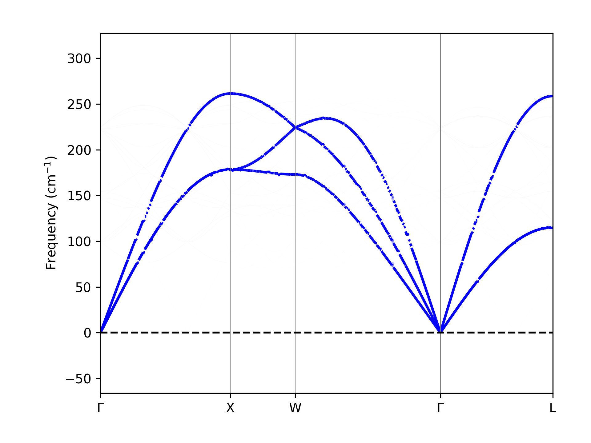

# Unfolding

[](https://mailhexu.github.io/unfolding/)
[](https://opensource.org/licenses/BSD-2-Clause)

A Python utility to unfold band structures of quasi-particles (electrons, phonons, magnons, etc.) from supercell calculations into the primitive cell representation. This is particularly useful for visualizing and analyzing the effects of defects, disorder, or complex magnetic order on the electronic or vibrational properties of materials.

## Features

- Unfold phonon band structures from **Phonopy** calculations.
- Unfold phonon band structures from **Abinit** DDB files.
- A simple and intuitive API.
- Integration with popular materials science libraries like [ASE](https://wiki.fysik.dtu.dk/ase/) and [Matplotlib](https://matplotlib.org/).

## Installation

You can install `unfolding` via pip:

```bash
pip install unfolding
```

Or, for the latest development version, you can install directly from the source:

```bash
git clone https://github.com/mailhexu/unfolding.git
cd unfolding
pip install .
```

## Usage

Here is a simple example of how to unfold the phonon band structure of a 3x3x3 FCC Cu supercell to the primitive cell, using data from a Phonopy calculation.

```python
import numpy as np
from ase.dft.kpoints import get_special_points, bandpath
import matplotlib.pyplot as plt
from unfolding.phonopy_unfolder import phonopy_unfold

# 1. Define the k-path for the primitive cell
from ase.build import bulk
atoms = bulk('Cu', 'fcc', a=3.61)
points = get_special_points('fcc', atoms.cell, eps=0.01)
path_highsym = [points[k] for k in 'GXWGL']
kpts, x, X = bandpath(path_highsym, atoms.cell, 300)
names = [r'$\Gamma$', r'X', r'W', r'$\Gamma$', r'L']

# 2. Perform the unfolding
ax = phonopy_unfold(
    sc_mat=np.diag([1, 1, 1]),  # Supercell matrix for phonopy
    unfold_sc_mat=np.diag([3, 3, 3]),  # Supercell matrix for unfolding
    force_constants='FORCE_CONSTANTS',  # Path to FORCE_CONSTANTS file
    sposcar='SPOSCAR',  # Path to SPOSCAR file
    qpts=kpts,  # q-points in the primitive cell
    qnames=names,  # Names of high-symmetry q-points
    xqpts=x,  # x-axis for the q-path
    Xqpts=X  # x-axis for high-symmetry q-points
)

# 3. Plot and save the result
plt.savefig('unfolded_band_structure.png', dpi=300)
plt.show()
```

This will produce the following unfolded band structure plot:



## Documentation

For more detailed information, tutorials, and API reference, please visit the official documentation at [https://mailhexu.github.io/unfolding/](https://mailhexu.github.io/unfolding/).

## Contributing

Contributions are welcome! If you find a bug, have a feature request, or would like to contribute code, please feel free to open an issue or a pull request on the [GitHub repository](https://github.com/mailhexu/unfolding).

## License

This project is licensed under the BSD 2-Clause License. See the [LICENSE](LICENSE) file for details.